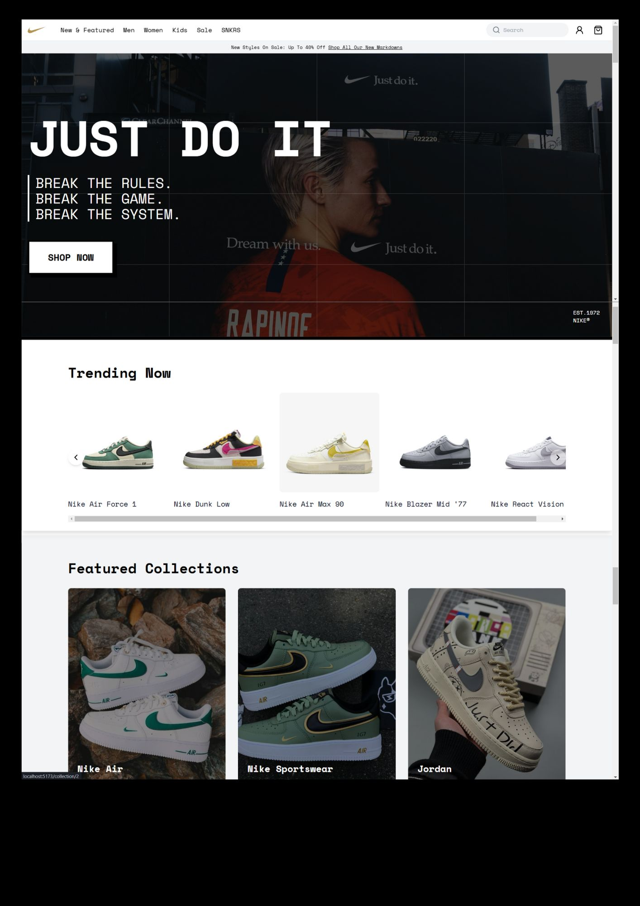

# Nike Clone - Brutalist Design

Welcome to my **Nike Clone**, a bold, unapologetic reinterpretation of the Nike website using a **brutalist design philosophy**. This project merges **cutting-edge frontend technologies** with a design style that prioritizes raw, striking visual impact over conventional minimalism. 

---

## Why Brutalist Design?

In an era dominated by polished, overly predictable interfaces, brutalism challenges conventions. This project:
- **Strips back ornamentation** to focus on essential content.
- **Breaks the grid** with deliberate asymmetry and bold typography.
- Celebrates a **raw, industrial aesthetic** that captures attention instantly.

The result is a website that doesn’t just display content—it makes a statement.

---

## Design Highlights

### 1. **Typography as the Hero**
- **Oversized Fonts**: Commands attention without relying on excessive visuals.
- **Contrasting Styles**: Pairing clean sans-serifs with intentionally rough, monospaced fonts for a striking juxtaposition.
- **Interactive Text Elements**: Subtle hover animations and color transitions that keep users engaged.

### 2. **Color Palette**
- **High-Contrast Black and White**: A stark foundation for brutalism.
- **Accent Colors**: Minimal use of bold red and muted gray to highlight calls-to-action.
- **Flat Colors**: Avoiding gradients for a raw and industrial feel.

### 3. **Layout**
- **Deconstructed Grids**: Sections overlap and break conventional boundaries, reflecting the raw brutalist ethos.
- **Content Hierarchy**: Strategically placed whitespace directs the user's focus where it matters most.
- **Edge-to-Edge Imagery**: Utilizing full-width banners to create impact without clutter.

### 4. **Hover Effects**
- Interactive elements feature **deliberate, yet subtle transitions** that add polish while preserving the raw aesthetic. 
- Buttons and links use bold underlines or color shifts, emphasizing functionality over flourish.

---

## Preview of the Website

Here's how the website looks in action:

---

## Technologies Used

While the focus here is on **design**, I leveraged the following technologies to bring this concept to life:
- **ReactJS**: For a responsive, component-based architecture.
- **TailwindCSS**: For rapid and precise styling.
- **TypeScript**: Ensuring clean, maintainable code with type safety.
